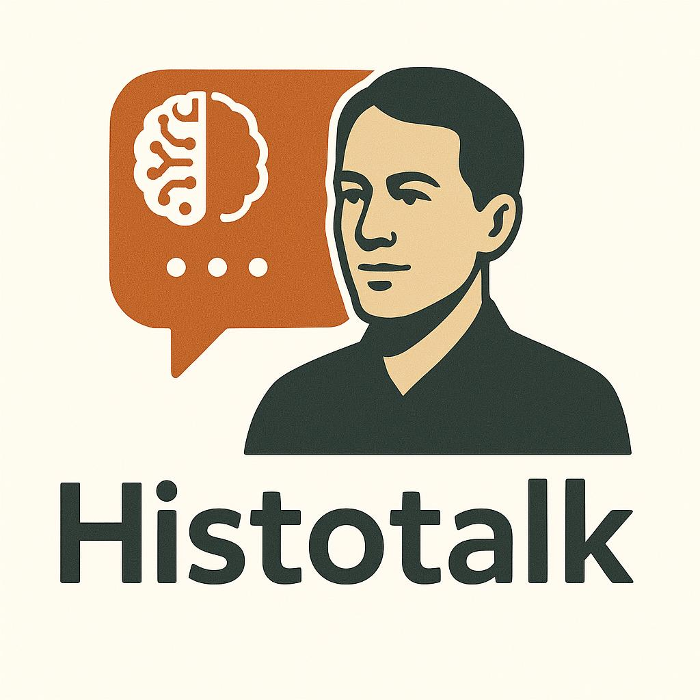

  

<h1 align="center">Histotalk</h1>

  <em>Simulasi Edukasi Sejarah dengan NPC Cerdas Berbasis Model Klasifikasi Kalimat & Contextual Retrieval</em> 
  <strong>ID Tim:</strong> CC25-CF085

  

---

## 🧠 Tentang Proyek

Histotalk adalah website interaktif yang mensimulasikan lingkungan museum sejarah digital. Pengguna dapat berinteraksi dengan NPC (Non-Playable Character) yang merepresentasikan tokoh-tokoh sejarah. NPC ini mampu memperkenalkan diri dan menjawab pertanyaan pengguna secara kontekstual berdasarkan data biografi dan gaya bicara tokoh tersebut.

### 🔍 Masalah yang Ingin Diselesaikan

Pembelajaran sejarah seringkali terasa pasif dan membosankan. Kami ingin menciptakan pengalaman belajar yang lebih:

- Menarik
- Personal
- Interaktif

Terutama untuk generasi muda yang akrab dengan game dan teknologi AI.

### 🧩 Solusi Teknologi

Kami menggunakan arsitektur chatbot dua-lapis:

1. **Model Klasifikasi Ringan (TensorFlow)**  
   Untuk mengenali jenis kalimat dan memberikan respons acak dari kelas yang relevan.

2. **Model Generatif Open-Source (seperti Gemma 2B)**  
   Digunakan sebagai fallback saat klasifikasi tidak meyakinkan. Kata-kata khas tokoh disisipkan ke dalam prompt sebagai konteks tambahan.

### 🎯 Tujuan

Menggabungkan teknologi pembelajaran mesin, antarmuka virtual, dan desain berbasis pengguna untuk menghasilkan solusi edukatif yang lebih imersif dan bermakna.

---

## 💡 Asal Usul Ide

Ide proyek ini lahir dari diskusi tim tentang tantangan pembelajaran sejarah yang monoton. Terinspirasi oleh kemajuan teknologi game dan AI, kami melihat potensi dalam menciptakan museum virtual interaktif.

Melalui pendekatan ini, pengguna tidak hanya membaca informasi sejarah, tetapi juga bisa *berbicara langsung* dengan tokoh sejarah melalui karakter AI. Hasilnya adalah pengalaman belajar yang lebih imersif, menyenangkan, dan mudah dipahami oleh semua kalangan.

---

## 👥 Tim Kami

| ID             | Nama                               | Learning Path                   |
|----------------|------------------------------------|----------------------------------|
| FC211D5Y0289   | Rafi Alisba Garjita Sutrisno       | Front-End & Back-End Developer  |
| MC271D5Y0626   | Richie Rich Kennedy Zakaria        | Machine Learning Engineer       |
| FC260D5Y0940   | Sincan Maulana                     | Front-End & Back-End Developer  |
| MC324D5Y1143   | Leo Prangs Tobing                  | Machine Learning Engineer       |
| FC260D5Y1989   | Nanda Safiq Alfiansyah             | Front-End & Back-End Developer  |
| MC009D5X2406   | Khoirunnisa                        | Machine Learning Engineer       |

---

> 🚀 [Kunjungi Histotalk Sekarang](https://histotalk.netlify.app/)
